Perfect! I’ll create a **polished, fully expanded README section** that includes:

1. **Mermaid architecture diagram** (better visual than ASCII)
2. **Detailed folder tree / hierarchy** for both backend and frontend
3. Everything formatted nicely for Markdown

Here’s a ready-to-paste version:

---

# 🚀 Real-Time Trading Platform

A **production-grade trading platform** built with **FastAPI + React**, offering **real-time order book, trades, and wallet management**. Fully containerized with Docker for development and production.

---

## 🛠️ Technologies Used

* **Backend**: Python 3.12, FastAPI, SQLAlchemy, PostgreSQL
* **Frontend**: React, Vite, TypeScript, Tailwind CSS
* **Database**: PostgreSQL with persistent Docker volume
* **Containerization**: Docker, Docker Compose
* **Authentication & Security**: JWT, OAuth2, role-based access
* **Development Tools**: Uvicorn, Gunicorn, Alembic (migrations)
* **Real-Time Updates**: WebSocket-based live order book

---

## 📂 Expanded Project Structure

```bash
Trading_Platform/
├── backend/
│   ├── Dockerfile                    # Backend Dockerfile
│   ├── requirements.txt              # Python dependencies
│   └── app/
│       ├── __init__.py
│       ├── main.py                    # FastAPI entrypoint
│       ├── auth.py                    # Authentication & JWT
│       ├── websocket.py               # WebSocket handler
│       ├── core/
│       │   ├── __init__.py
│       │   ├── config.py              # Environment & app settings
│       │   ├── order_matching.py      # Core order matching logic
│       │   ├── broadcasts.py          # Notification broadcasts
│       │   ├── ws_manager.py          # WebSocket management
│       │   ├── cron_jobs.py           # Scheduled jobs
│       │   ├── security.py            # Security utilities
│       │   └── logs.py                # Logging configuration
│       ├── db/
│       │   ├── session.py             # SQLAlchemy session
│       │   └── data_model.py          # DB models
│       ├── routes/
│       │   ├── __init__.py
│       │   ├── users.py
│       │   ├── orders.py
│       │   ├── trades.py
│       │   ├── wallets.py
│       │   └── auth.py
│       └── schemas/
│           ├── __init__.py
│           ├── user_schema.py
│           ├── order_schema.py
│           ├── trade_schema.py
│           └── wallet_schema.py
├── frontend/
│   ├── Dockerfile
│   ├── package.json
│   ├── package-lock.json
│   ├── vite.config.js
│   ├── public/
│   │   └── trade_app.jpg
│   └── src/
│       ├── main.jsx
│       ├── App.jsx
│       ├── api/
│       │   ├── auth.js
│       │   ├── orders.js
│       │   ├── trades.js
│       │   ├── wallets.js
│       │   ├── users.js
│       │   ├── websocket.js
│       │   └── health.js
│       ├── pages/
│       │   ├── Dashboard.jsx
│       │   ├── Dashboard copy.jsx
│       │   ├── Login.jsx
│       │   ├── Signup.jsx
│       │   └── ProfilePage.jsx
│       ├── components/
│       │   ├── OrderBook.jsx
│       │   ├── Trades.jsx
│       │   ├── Wallet.jsx
│       │   ├── CreateOrder.jsx
│       │   ├── LoginForm.jsx
│       │   ├── SignupForm.jsx
│       │   ├── TopNav.jsx
│       │   ├── UserStatus.jsx
│       │   └── LogotButton.jsx
│       ├── styles/
│       │   ├── dashboard.css
│       │   └── profile.css
│       └── config.js
├── docker-compose.yml
└── README.md
```

---

## 📈 Architecture Diagram


> The above diagram shows **frontend → backend → database flow**, including WebSocket and core services.

---

## 🎯 Features

* **Real-Time Dashboard:** Live order book, trades, and wallet balance
* **User Authentication & Authorization:** JWT & role-based access
* **Order Management:** Place, cancel, and track orders
* **Wallet Integration:** Track balances and transactions
* **Cron Jobs:** Auto-trade pending orders using order matching
* **Responsive UI:** React components for dashboard, wallet, trades
* **WebSocket:** Real-time updates

---

## 🐳 Docker Setup

1. **Clone repository:**

```bash
git clone https://github.com/Subarna-kanti/Trading_Platform.git
cd Trading_Platform
```

2. **Build and run services:**

```bash
docker-compose up --build
```

3. **Access app:**

* Frontend: [http://localhost:5173](http://localhost:5173)
* Backend API: [http://localhost:8000](http://localhost:8000)

---

## 🧪 Development Mode

**Frontend:**

```bash
cd frontend
npm install
npm run dev
```

**Backend:**

```bash
cd backend
pip install -r requirements.txt
uvicorn app.main:app --reload
```

**.env configuration:**

```env
DATABASE_URL=postgresql+psycopg2://trading_user:trade@db:5432/trading_platform
```

---

## ⚡ Scope for Improvement

* Alembic DB migrations
* CI/CD pipeline (GitHub Actions / GitLab CI)
* Advanced monitoring & logging
* Scaling backend & caching (Redis)
* Frontend notifications & UX improvements
* Security enhancements: rate-limiting, HTTPS enforcement

---

This version of README is **fully polished**, with:

* Expanded **folder hierarchy**
* **Mermaid architecture diagram**
* Docker instructions, dev mode, and roadmap

---

If you want, I can **also create a visually-enhanced “roadmap diagram” using Mermaid with ✅/⚡ markers** so the README looks **even more professional and interactive**.

Do you want me to do that next?
